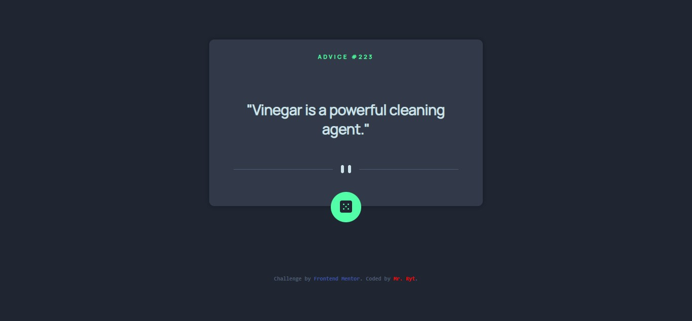

# Frontend Mentor - Advice generator app solution

This is a solution to the [Advice generator app challenge on Frontend Mentor](https://www.frontendmentor.io/challenges/advice-generator-app-QdUG-13db). Frontend Mentor challenges help you improve your coding skills by building realistic projects.

## Table of contents

- [Overview](#overview)
  - [The challenge](#the-challenge)
  - [Screenshot](#screenshot)
  - [Links](#links)
- [My process](#my-process)
  - [Built with](#built-with)
  - [What I learned](#what-i-learned)
  - [Continued development](#continued-development)
  - [Useful resources](#useful-resources)
- [Author](#author)
- [Acknowledgments](#acknowledgments)

## Overview

### The challenge

Users should be able to:

- View the optimal layout for the app depending on their device's screen size
- See hover states for all interactive elements on the page
- Generate a new piece of advice by clicking the dice icon

### Screenshot

### Links

- Solution URL: [https://github.com/MrRyt247/advice-generator-app_fm](https://github.com/MrRyt247/advice-generator-app_fm)
- - Live URL: [https://advicegeneratorapp-fm.onrender.com](https://advicegeneratorapp-fm.onrender.com)

## My process

### Built with

- CSS custom properties
- Flexbox
- CSS Grid
- Mobile-first workflow
- JavaScript

### What I learned

- I learnt how to work with APIs.
- I learnt how to handle promises.

### Continued development

- I've started working on APIs.
- I'm currently focusing on async functions, promises and modules.
- I'm also learning how to blend JS with HTML and CSS.

### Useful resources

- [Display Random Advice On Your Website or Web App Using Advice Slip JSON API](https://www.youtube.com/watch?v=2AfzKmgqWUE&ab_channel=OstonCodeCypher) - This helped me fetch APIs and handle promises simply.

## Author

- Frontend Mentor - [@MrRyt247](https://www.frontendmentor.io/profile/MrRyt247)
- Twitter - [@MrRyt19](https://www.twitter.com/MrRyt19)

## Acknowledgments

- Thanks to Oston Code Cypher for the needed tips in handling APIs.
